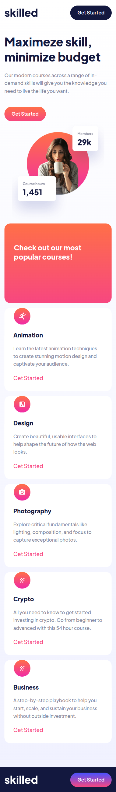
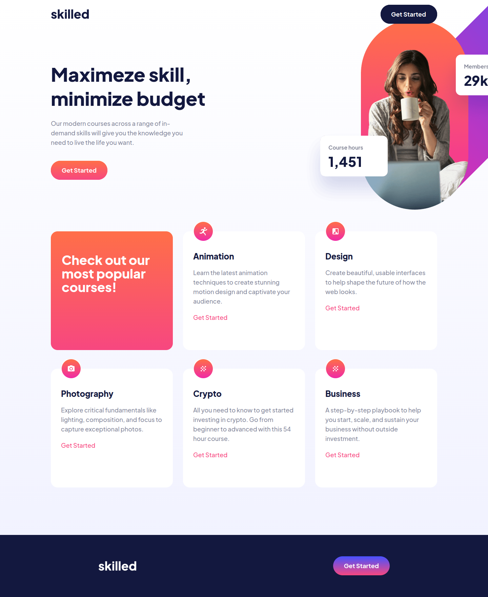

## Welcome! 👋

Hello, this was my solution to the Skilled e-learning landing page challenge on the Frontend Mentor website. Suggestions for improvement can be sent to my LinkedIn profile at: https://www.linkedin.com/in/genildo-cerqueira-91888786/.

### The challenge

<i>View the optimal layout depending on their device's screen size
See hover states for interactive elements</i>